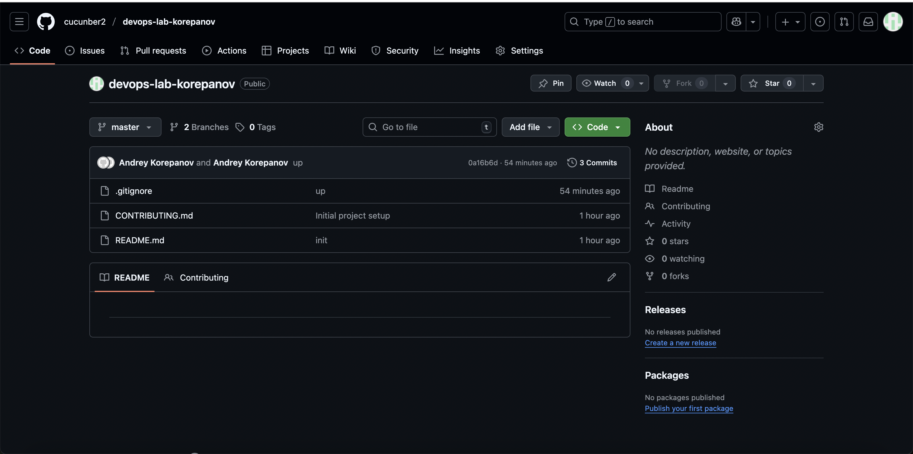
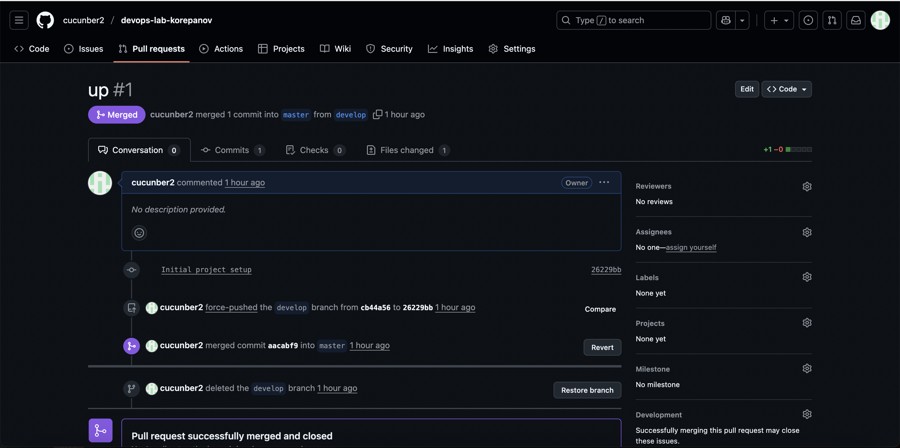

University: [ITMO University](https://itmo.ru/ru/)

Faculty: [FICT](https://fict.itmo.ru)

Course: [Cloud platforms as the basis of technology entrepreneurship](https://) ADD link

Year: 2025/2026

Group: U4225

Author: KOREPANOV ANDREY ANDREEVICH

Lab: Lab0

Date of create: 29.09.2025

Date of finished: 29.09.2025

1. Создал репозиторий

локально инициализировал git, добавил файлы и закоммитил изменения с помощью git commit
2. создал ветку develop с помощью команды `git checkout -b 'develop'
3. Создал пулл реквест и с помощью ребейза с

4. История коммитов

