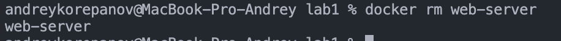

University: [ITMO University](https://itmo.ru/ru/)
Faculty: [FICT](https://fict.itmo.ru)
Course: [Cloud platforms as the basis of technology entrepreneurship](https://) ADD link
Year: 2025/2026
Group: U4225
Author: KOREPANOV ANDREY ANDREEVICH
Lab: Lab1
Date of create: 29.09.2025
Date of finished: 29.09.2025

1.
2.
3.
    
    
    
4.
    
    
    
5.
    
    
    
    
6.
    
    
    
    
    
7.
    
    
    
    
    

Приложение на питоне:
1. Ставим необходимую версию python (3.9) для локальной разработки с помощью pyenv

```
pyenv install 3.9
pyenv local 3.9
```

2. Поднимаем окружение с помощью venv

```
python -m venv venv
```

3. Ставим Flask

```
pip install flask
```

4. Фиксируем зависимости в requirements.txt

```
pip freeze > requirements.txt
```

5. Пишем простое приложение на flask:

```
from flask import Flask

app = Flask(__name__)

@app.route("/")
def hello():
    return "Hello from Docker!"

if __name__ == "__main__":
    app.run(host="0.0.0.0", port=5000)
```

где app инстанс сервера
где app.route - путь, по которому у нас будет доступна view

где app.run запускает наш сервер на python (для локальной разработки на macos лучше ставить 5000, но можно указать port в .env + os.getenv("PORT"))

6. Пишем Dockerfile

FROM - задаем базовый образ
WORKDIR - задаем рабочую директорию контейнера

RUN - запускаем команду обновлия зависимостей и ставим основные пакеты

COPY - копируем requirements.txt из нашей папки в /app

RUN - ставим все зависимости python

COPY - копируем app.py из нашей папки в /app

RUN - создаеи юзера с помощью unix команды useradd

USER - ставим основного пользователя системы appuser

EXPOSE - открываем порт контнейра 5000 

ENV - ставим переменную окружения

CMD - запускаем скрипт

конмада для билда образа:

docker build -t app .

команда для старта контейнера:

docker run -d -p 5050:5000 --name flask-app app


