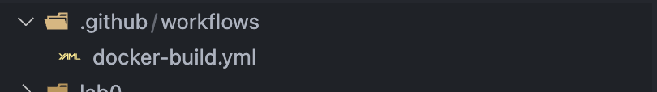
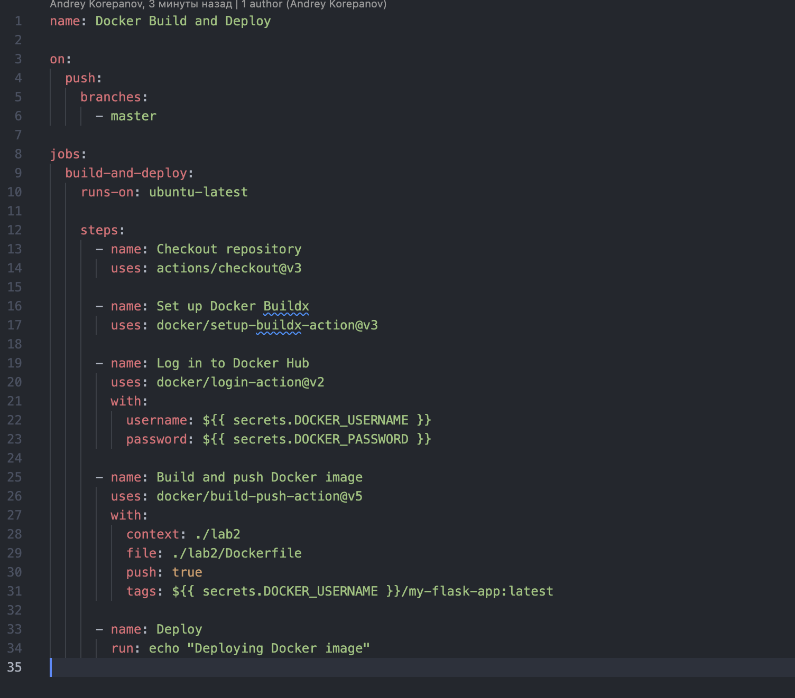
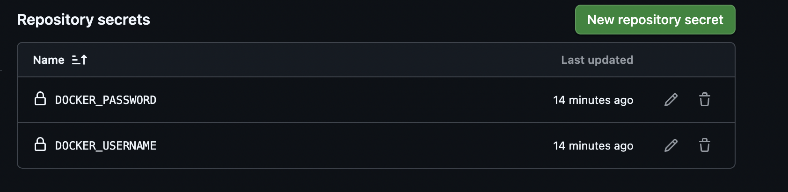
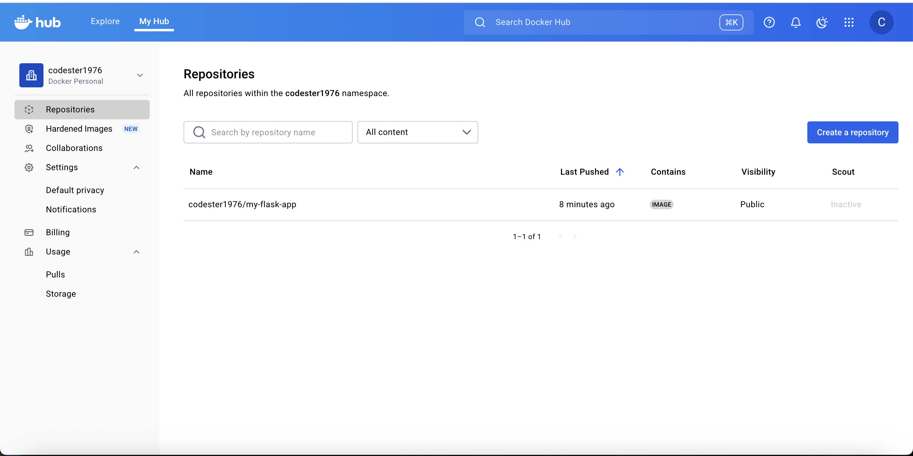
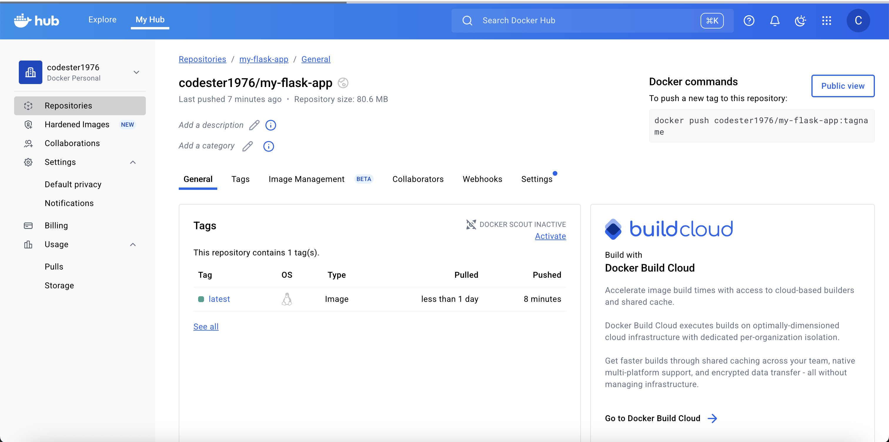

University: [ITMO University](https://itmo.ru/ru/)

Faculty: [FICT](https://fict.itmo.ru)

Course: [Cloud platforms as the basis of technology entrepreneurship](https://) ADD link

Year: 2025/2026

Group: U4225

Author: KOREPANOV ANDREY ANDREEVICH

Lab: Lab0

Date of create: 01.10.2025

Date of finished: 01.10.2025

1. Создать папку .github/workflows/ в корне проекта c docker-build.yml

2. Прописали следующую конфигурацию

где:
    на пуш в мастер ветку исполняем следующие джобы (за основу ранера берем образ убунту последний версии)
    первым шагом копирует наш репозиторий в мастер ветке
    ставим buildx чтобы делать пуши в docker hub
    далее входим в docker hub с помощью кредов, которые указали в репозитории
    
    далее собираем образ и пушим его в docker hub

из особенностей стоит отметить context и file, тк основная сборка находится в папке lab2, нам нужно указать, что контекст запуска скрипта был именно в папке ./lab2, а путь до файла с докерфайлом находится в ./lab2/Dockerfile

далее для красоты выводим фразу, что приложение деплоится в докер хаб

результат пуша:

https://hub.docker.com/repository/docker/codester1976/my-flask-app/general

