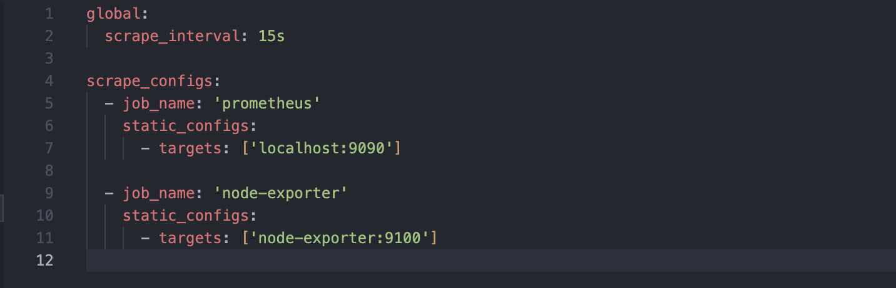
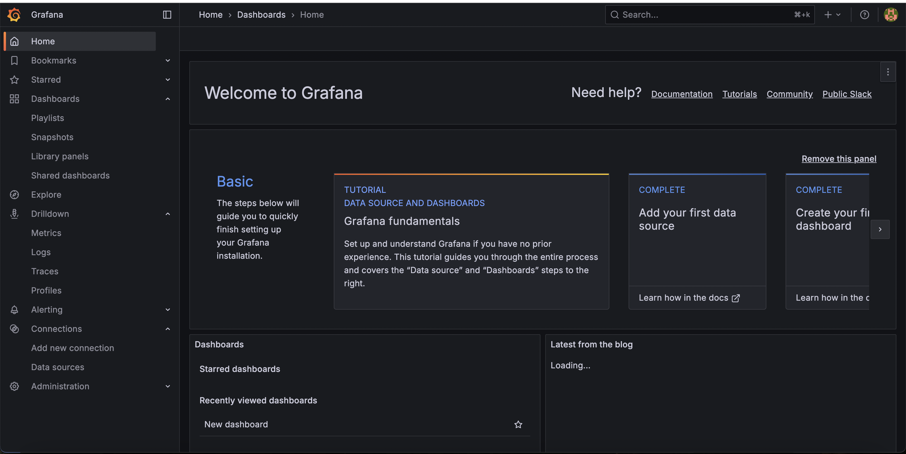
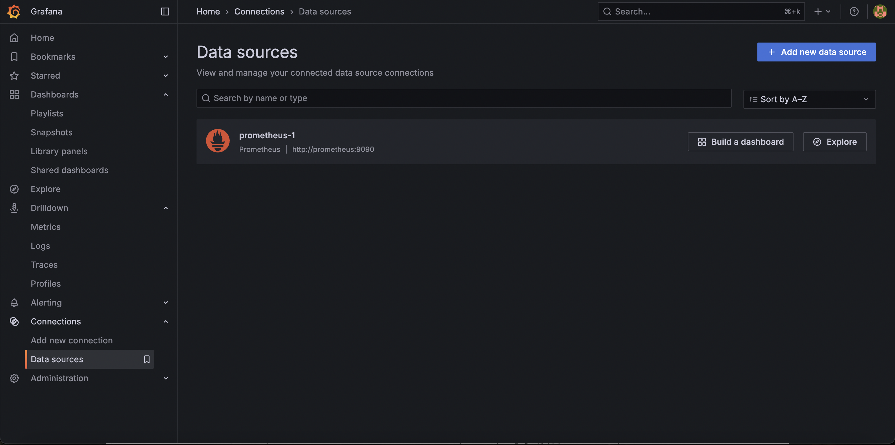
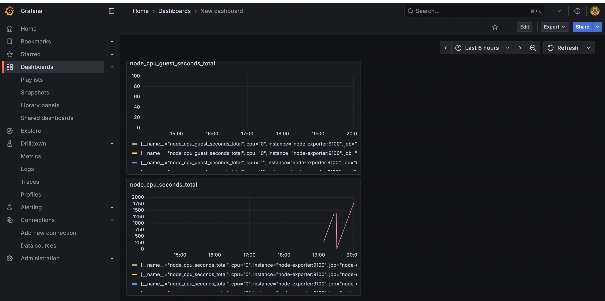
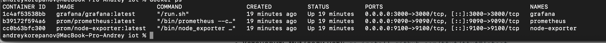

University: [ITMO University](https://itmo.ru/ru/)

Faculty: [FICT](https://fict.itmo.ru)

Course: [Cloud platforms as the basis of technology entrepreneurship](https://) ADD link

Year: 2025/2026

Group: U4225

Author: KOREPANOV ANDREY ANDREEVICH

Lab: Lab0

Date of create: 01.10.2025

Date of finished: 01.10.2025

1. Создали настройку для prometheus

2. Для простоты работы, был создан docker-compose файл, чтобы руками не поднимать отдельно сущности node exporter и prometheus (и других контейнров)

Описаны базовые сервисы:
  - node-exporter
  - prometheus

Для них указаны image, container_name, ports и основные команды для запуска (command)
Также из особенностей создана изолированная сеть, чтобы контейнеры работали только в ней и не аффектила на другие

также каждый сервисы был подключен к этой сети

3. Был добавлен инстанс графаны в docker-compose
4. Добавлены volumes для всех сервисов, запуск сервисов выполняется с помощью `docker-compose up -d`

5. Запущена графана 

6. Добавлен prometheus как источник данных

7. Создана борда с базовыми метриками

8. Сервисы работают и собирают информацию

